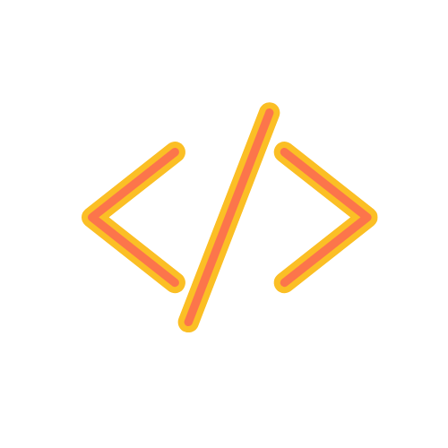

 
  

#  ✨ Hi, I'm Karina 👋🏼👩🏽‍💻            ✨ 
 
  
 As a software engineer who demands to be constantly intellectually challenged, I am eager to experience the continuous journey the world of software development has to offer.

## Find me on the web 🌎: 

<picture>
     <source media="(prefers-color-scheme: dark)" srcset="./g1-dark.png">
    
</picture>

   - Follow my journey on <a href="https://www.instagram.com/anirak.dev/">Instagram</a> 📷
   - Learning new skills on <a href="https://codepen.io/anirak"> Codepen</a> 📝
   - Sharing updates on <a href="https://www.linkedin.com/in/karinadgarces/">LinkedIn</a> 📇
   - Feel free to reach out <a href="mailto:karinadgarces@gmail.com">here</a>  📧

 

## Languages and Tools ⚙️:
<picture>
     <source media="(prefers-color-scheme: dark)" srcset="./tag-dark.png">
    
</picture>
Languages:  Python | JavaScript (ES6) | HTML & HTML5 | CSS & CSS3
 
Libraries and Frameworks:  Django | Git & GitHub | React | Node.js | Express.js 
 
Database: MongoDB | Mongoose |  SQL
 

  

           <a href="https://developer.mozilla.org/en-US/docs/Web/JavaScript" target="_blank" rel="noreferrer"> 
  

 
